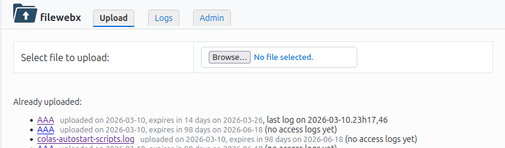
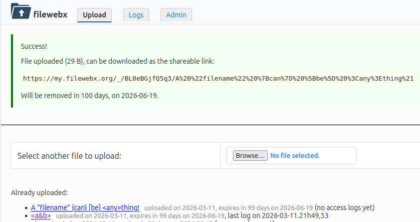
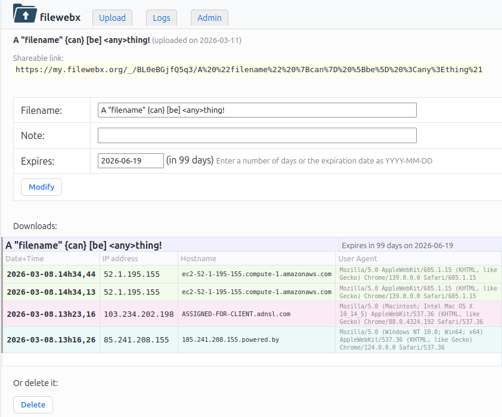
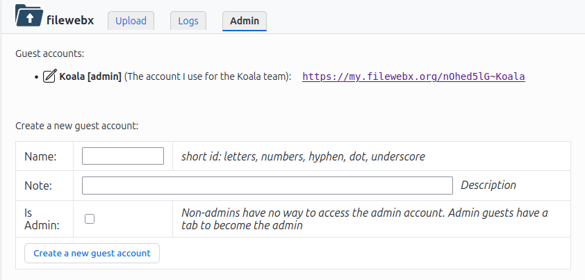

# filewebx

 **filewebx** is a lightweight, self-hosted Bash CGI system for private file exchange. It uses **Capability URLs** to provide security without the friction of user accounts. You upload a file, and the system generates a non-guessable, secret link that you can share.

It is your own simpler WeTransfer / MASV / Smash / SwissTransfer / JumpShare / pCloud. It provides nice security against external threats, but minimal separation between admins and guests of the system.

## Features

- It does not require logins and passwords for convenience and simplicity, but still provides significant security by using [Capability URLs](https://www.w3.org/TR/capability-urls/) , i.e. the urls used are not discoverable nor guessable, even by people you send links to. E.g:
  * Admin URL: `https://my.filewebx.org/adminpassword`
  * Guest URL: `https://my.filewebx.org/guestpassword~guestid`
  * Download URL: `https://my.filewebx.org/_/filepassword/filename-slug`
- Easy to deploy and upgrade: 3 bash scripts.
- Data is kept as plain files, so easy to administrate
- It is privately self-hosted: everything is on your own server, nothing is handled by a third party.
- It detects interrupted uploads and cancel them
- The main account can create guests accounts — by just giving them a link — that can use the system without being able to use or see the files of other accounts
- files are removed after some specifiable time, defaulting to 100 days
- the filename in the URL generated for download is a [slug](https://en.wikipedia.org/wiki/Clean_URL#Slug) that is lowercase letters, with accents removed or digits, the rest replaced by an hyphen, to avoid cumbersome url-encodings. 

## Requirements

It should work on any linux system with a web server and a CGI interface. Tested with Apache. It supposes it has its own virtual server setup, with all files reachable from the outside at top level be executable CGI scripts.

Also, it requires **iconv**. It should be already present on your system, but if not, Install it by your linux package manager.

## Installation

1. Create a web site. Suppose the files will reside at `/www/filewebx/`, you will need to create the directory with 2 subdirectories in it (if www-data is the account which runs your server, it can be lshttps for openlitespeed):
   
```
mkdir -p /www/filewebx/{data,cgi};  chown -R www-data:www-data /www/filewebx
```
   
   Note: for convenience, it is advised to make your account on the server a member of the `www-data` group.

2. Choose an "admin password", which will be the URL of the main admin dahsboard. You can run the provided `./doc/random-string.sh N` to generate one. For example in this doc, `yJDdYNEXmB`. The longer, the safer.

3. configure it. See for instance how to do it for apache, at the url https://my.filewex.org and a directory `/www/filewebx` and the admin password `yJDdYNEXmB` in the file [doc/apache-sample.conf](apache-sample.conf).
Install the SSL certificates if needed. I personally use a wildcard certificate from [let's encrypt](https://letsencrypt.org/) that I set in the main apache config, so I do not need to mention it in my virtual hosts.
For other servers (nginx, litespeed, caddy, ...) just ask your favorite AI to convert `doc/apache-sample.conf` into a configuration specific to your setup.

4. copy into your `cgi` dir (e.g: `/www/filewebx/cgi`) the files:
  - `filewebx` as your chosen admin password (e.g: `yJDdYNEXmB`)\
    `rsync filewebx root@my.filewebx.org:/www/filewebx/cgi/yJDdYNEXmB`
  - `filewebdl` as `_`:\
    `rsync filewebdl root@my.filewebx.org:/www/filewebx/cgi/_`
  - `cgibashopts` from  [cgibashopt GitHub repository](https://github.com/ColasNahaboo/cgibashopts)\
    `wget https://raw.githubusercontent.com/ColasNahaboo/cgibashopts/refs/heads/main/cgibashopts`\
    `rsync cgibashopts root@my.filewebx.org:/www/filewebx/cgi`\
    `rm cgibashopts`

5. install a crontab entry to clean daily the obsolete files after their expiraton date, by accessing your admin URL with the parameter `mode=clean`, e.g:
   
```
12 03 * * * curl -s 'https://my.filewex.org/yJDdYNEXmB?mode=clean'
```

### Configuration

Optionally, you can provide a `filewebx.conf` configuration file above the root directory (e.g: `/www/filewebx/filewebx.conf`) to set some parameter in the bash syntax (this file will be read — sourced — as a bash file):

- **validity** default expiration date, in days. Default: 100 \
  e.g: `validity=365`
- **passlen** length of the various generated random passords and tokens. Default: 12 \
  e.g: `passlen=8`
- **freequota** the free space to leave on disk. Uploading a file that would reduce the free space under the freequota will be refused. In bytes or with a K, M, G suffix to indicate Kilobytes, Megabytes, or Gigabytes, or suffixed by % to mean a percentage of the total disk space. Default: 30G \
  e.g: `freequota=5%`, `freequota=120M`, `freequota=1024K`, `freequota=1000000`
- **guestquotas** same, but for specific guests. See below the "Quotas" section. \
  e.g: `guestquotas=(Anna 3000M Bob 4G Chuck 50%)`
- **LANG** and **LC_ALL** set these if you use accents in your file names and find that they are corrupted. The default is to set them to `en_US.UTF-8` if the script finds them empty. \
  e.g: `LANG=en_US.UTF-8; LC_ALL=en_US.UTF-8`
- **noslug** if `true` or `yes` or `on`, do not "slugify" the file names in the download URLs, just use the full url-encoded file name. Default is `false`. \
  e.g: for a file named `L'haïku sécha près du bûtô, où le maçon bâilla.pdf` \
  `noslug=false` → `https://.../l-haiku-secha-pres-du-buto-ou-le-macon-bailla.pdf` \
  `noslug=true` → `https://.../L%27haïku%20sécha%20près%20du%20bûtô%2C%20où%20le%20maçon%20bâilla.pdf`

You could also re-declare of any bash variables and functions for advanced customisations, but these may break on upgrades. May be useful however to experiment with tweaks.

### Upload size limit

Although Filewebx does not impose a size limit on your uploaded files, your web servber does, to prevent Denial of Service (DoS) attacks (e.g., someone trying to crash your server by uploading a 100 GB file of junk). To increase it:

- **For apache**, the setting is `LimitRequestBody`. E.g. to enable uploading files up to 5G globally in your filewebx VirtualHost conf inside a Directory or Location directive: `LimitRequestBody 5368709120`
- **For nginx**, [client_max_body_size](https://docs.rackspace.com/docs/limit-file-upload-size-in-nginx).
- **For caddy** `max_size 5GB` inside a `request_body {...}` block.
- **For Lighttpd** via the `server.max-request-size directive`. Unlike Apache or Nginx, Lighttpd measures this parameter strictly in KiloBytes (1GB = 1,048,576 KB).For 5 GB, the math is 5 x 1,048,576 = `5242880`. E.g: `server.max-request-size = 5242880`.

### Quotas

You can declare quotas in the configuration file by the variables `freequota` for all accounts, and in the asociative array `guestquotas` for specific guests. Quotas specify the amount of space that must **stay free** on the filesystem, not the amount used by the uploaded files.

Quotas are number of bytes by default, but can be suffixed with a letter: K, M, G, % to indicate respectively kilobytes, megabytes, gigabytes, and percentage of the filesystem total size respectively. E.g:

```bash
freequota=30% # leave always 30% disk free for the main account
guestquotas=(Anna 3000M Bob 4G Chuck 50%) # different quota for different guests
                                          # other guests use $freequota
```

### Geolocalization

Optionally, you can have the host gelocalized when displaying logs. Just install the [MaxMind](https://www.maxmind.com) GeoIp databases.
If you already have them installed, they will be auto-detected and used if present at `/var/lib/GeoIP/GeoLite2-City.mmdb` and `/var/lib/GeoIP/GeoLite2-ASN.mmdb`. If they reside elsewhere, set the variables `geoipcity` and `geoipasn` in the configuration file.

To install them if you do not already have them on your server:
1. [SignUp](https://www.maxmind.com/en/geolite2/signup) for a free account
2. Generate a License Key in your account dashboard. Download the provided config file and copy it in `/etc/GeoIP.conf` on your server.
3. Install the `mmlookup` and `geoipupdate` utilities. In Debian/Ubuntu systems: `sudo apt install geoipupdate mmdb-bin`
4. Run `sudo geoipupdate`
5. add a weekly update of the database in root crontab:\
   `0 12 * * 3 geoipupdate`

### Updating
To update, just re-clone the repository and copy the `filewebx` and `filewebdl` as above in step 4.

## Usage

You can then use the script by going to the URL to the admin account provided by the install script, in our example: `https://my.filewebx.org/yJDdYNEXmB`
If you are using it from an IP address defined in your web server config (in the examples 88.181.8.140 or 32.166.24.45), you can just go to `https://my.filewebx.org`. It will redirect also to the admin account above.

- The default tab, Upload files:



- Uploading a file `my-sent-file.foo` will provide you with a link to give to others, in the form  `https://my.filewebx.org/_/OLw6bZrh65lj/my-sent-file.foo`. Note that a random "password" (more precisely, a token) is generated, `OLw6bZrh65lj` which is the important part, the rest being a kind of label for easier handling by humans.



- Past uploaded files are shown. Clicking on one shows you the download logs, and allow you to:
  - Rename the file. The shareable link URL will change, but the old ones will still work, only some tools other than normal browsers may save the file under the old name.
  - Add a personal note (a free comment, not sent via the link)
  - Change the expiration date. Files are kept 100 days by default. You can specify it either as a number of days from now, or the date in `YYYY-MM-DD` format.



- The Logs tab enable to see all download logs of all files under the current account

- The Admin tab, present only for the admin account, allows to create guests accounts and lists all the active one.

- The log entries are colored with 20 colors chosen to be as distinct as possible for the human eye, [maximizing perceptual spacing](https://programmingdesignsystems.com/color/perceptually-uniform-color-spaces/), I used [golden-angle hue sampling](https://medium.com/@winwardo/simple-non-repeating-colour-generation-6efc995832b8) (137.508° steps), a well-known approximation of greedy max-min spacing to allow distinct colors to distinct IPs. I use a pre-computed table of 20 colors instead of dynamically generating them, as it is cumbersome to do in bash and a bit of overkill in this case. \
Note that each IP adress always get the same color for each of its occurence in the logs table.

## Guest accounts
A guest account will only see its own uploaded files. A guest account will have a URL of the form\
`https://my.filewebx.org/guestpassword~guestid`\
with links to download its files in the  form\
`https://my.filewebx.org/_/~guestid/filepassword/my-sent-file.foo`\
For convenience, try to keep the guest ids as short as possible. Only alphanumeric and dot, hyphen and underscore characters are accepted.

**Admin guest accounts** (accounts marked as admin) have a link to get back to the main admin account. They are thus very useful to create separate namespace that you can use yourself when providing files for different audiences (e.g. work, family, surfing, gaming...).

**Non-admin guest accounts** are meant to be given to other people, to enable them to upload files and get sharable download links on their own. Unlike admin guest accounts, they will not be able to access (or even guess) the main admin account, see other accounts uploaded files, not create other guests.




## Data structure and Implementation

```text
/www/filewebx/
├── filewebx.conf           # Global configuration (optional)
├── cgi/                    # The Web Root
│   ├── yJDdYNEXmB          # filewebx, renamed as your admin "password"
│   ├── _                   # filewebdl script, renamed as underscore
│   ├── cgibashopts         # bash library used by filewebx
│   └── PZdn7Lz7a7~Anna     # symlink to yJDdYNEXmB. Anna guest account
└── data/                   # Writable by www-data (logs and metadata)
    ├── meta                # global metadata (cached client timezones)
    ├── trash/              # "deleted" files and accounts are moved there
    ├── v3u1WS.log          # access logs for file of token v3u1WS
    ├── v3u1WS.meta         # metadata (name, note, ...) for same
    ├── v3u1WS.cache        # html rendering of the its logs cache
    ├── v3u1WS,foo.txt      # the file itself, of real name foo.txt
    └── ~Anna/              # account and trackers info for Anna
        ├── meta            # metadata of the Anna account (notes, is-admin)
        ├── trash           # "deleted" files and accounts of Anna
        ├── aqVnQ.log       # access logs for file of token aqVnQ of Anna
        ├── aqVnQ.meta      # metadata for file of token aqVnQ of Anna
        └── aqVnQ,bar.jpg   # the file itself, of real name bar.jpg

```

Metadata — bash Associative Arrays — are stored in "bash native" format via `declare -p` via the embedded functions of `metadata.sh` of my collection of bash snippets [colas-bash-lib](https://github.com/ColasNahaboo/colas-bash-lib)

Logs are lines of 4 tab-separated values: date, ip-address, address-name, user-agent.

**changing the main password** in case it is compromised, just log on your server to rename the main filewebx script. E.g.:\
  `mv /www/filewebx/cgi/yJDdYNEXmB /www/filewebx/cgi/hthie9Oweeob`
Do not forget also to change it in your apache configuration, if present.

**changing the password of a guest account** in case it is compromised, just log on your server to change the "password" part (before the tilde) of the cgi script link. E.g.:\
  `mv /www/filewebx/cgi/ieda6Waiwan9ath~Bob /www/filewebx/cgi/fohthie9Owee~Bob`

## License

MIT License - (c) 2026 Colas Nahaboo.
In a nutshell: do whatever you want with this, credit me if you please, but expect no warranty.

## Release notes

- v2.3.0 2026-06-05 feat: the config variable "noslug" enable the previous behavior of not slugify the URLs.
  docs: the config file variables are better documented.
  fix: file extensions are preserved during slugification.
  fix: logs are sorted by most recent upload date first.
- v2.2.2 2026-06-04 feat: the URL of the file is now a "slug" for more readability
- v2.2.1 2026-05-26 fix: files uploaded in a guest account had a note set to the note of the guest account
- v2.2.0 2026-04-16 perf: logs rendered html cached
  feat: guest quotas
- v2.1.2 2026-04-12 feat: configurable quota. By default, 30% of disk must stay free.
- v2.1.1 2026-04-12 fix: note field of file properties was pre-filled with note field of the guest account
- v2.1.0 2026-04-11 dates are now stored in logs as UTC ISO.
  Previously was YYYY-MM-DD.HHhMM,SS in the server local time, but still work.
  Optionally the host are geolocalized (organisation & country) in log display.
- v2.0.5 2026-04-10 displayed dates are now in the timezone of the client browser, not anymore in the timezone of the server
- v2.0.4 2026-04-05 ui: fix the "copy url" button looks
- v2.0.3 2026-04-04 ui: fix the "leaving window?" dialog appearing sometimes
- v2.0.2 2026-03-30 ui: avoid upload button moving to the right on large windows
- v2.0.1 2026-03-25 "copy icon" button to copy the shareable link
- v2.0.0 2026-03-11
  - Two-Script Architecture: The main `filewebx` script handles the UI and management, while a minimal `_` script (powered by `filewebdl`) handles logging and file delivery with the original file name.
  - Improved Logging: Tab-separated logs, the same form as for [mailpixtracker](https://github.com/ColasNahaboo/mailpixtracker), this avoids relying on having to read the web server logs, which are often protected and in variable formats.
  - Guest Accounts: Admin can create "Guest" environments via simple URL tokens, keeping different users' file lists isolated. Some guests can be declared admins, to ease switching accounts when using different guest accounts for different contexts, but by the same person.
  - More admin features: deleting files, changing expiration dates, editing and deleting guest accounts.
- v1.0.0 2026-03-03 First public release
