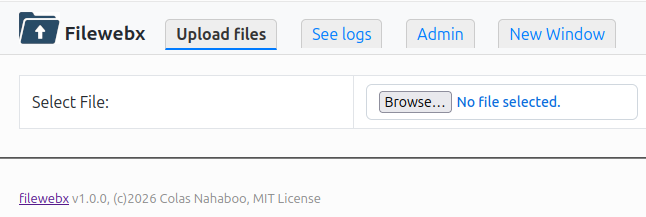

# filewebx


A simple and efficient bash CGI web script to transfer and exchange files privately. It uploads the file on your server, and generates a link that you can send to other people to download the file with no need to create an account. 



## Features

- It does not require logins and passwords for convenience and simplicity, but still provides significant security by using [Capability URLs](https://www.w3.org/TR/capability-urls/) , i.e. the urls used are not discoverable nor guessable.
- Easy to deploy and upgrade: A single bash script.
- Data is kept as plain files, so easy to administrate
- It is privately self-hosted: everything is on your own server, nothing is handled by a third party.
- It detects interrupted uploads and cancel them
- The main account can create guests accounts — by just giving them a link — that can use the system without being able to use or see the files of other accounts
- files are removed after 100 days.

## Requirements

- It should work on any linux system with a web server and a CGI interface. Tested with Apache.

## Installation

1. Create a web site. Suppose the files will reside at `/www/filewebx`, you will need to create the directory with 2 subdirectories in it (if www-data is the account which runs your server, it can be lshttps for openlitespeed):
```
mkdir -p /www/filewebx/{data,cgi};  chown -R www-data:www-data /www/filewebx
```
2. configure it. See for instance how to do it for:
  - **apache**, at the url https://filewex.mysite.com and a directory `/www/filewebx` and the name `aiV6shujahla4ei` in the file [doc/apache-sample.conf](apache-sample.conf)
  - **nginx**, in the example [doc/nginx-sample.conf](doc/nginx-sample.conf) (needs fcgiwrap)
  - **openlitespeed**, in the example [doc/openlitespeed-sample.conf](doc/openlitespeed-sample.conf)
  - **caddy**, in the example [doc/caddy-sample.conf](doc/caddy-sample.conf} (needs fcgiwrap and the cgi plsugin)
It did not include the SSL certificates, install them as you are used to. I personally use a wildcard sertificate from [let's encrypt](https://letsencrypt.org/) that I set in the main apache config, so I do not need to mention it in my virtual hosts.

3. create your configuration file, e.g. `myconfig.conf` by following the examples in [doc/filewebx-sample.conf](doc/filewebx-sample.conf).

4. run the install `INSTALL myconfig.conf` or install simply by hand by looking at it. The cgibashopts used is the standard one that can also be found at [cgibashopt GitHub repository](https://github.com/ColasNahaboo/cgibashopts)

5. install a crontab entry to clean daily the obsolete files after their expiraton date, e.g:
```
12 03 * * * curl -s '`https://filewex.mysite.com/cgi/aiV6shujahla4ei?mode=clean'
```

## Usage

You can then use the script by going to the URL to the admin account provided by the install script, in our example: `https://filewex.mysite.com/cgi/aiV6shujahla4ei`
If you are using it from an IP address defined in your web server config (in the examples 88.181.8.140 or 32.166.24.45), you can just go to `https://filewex.mysite.com`. It will redirect also to the admin account above.
- The default tab, Upload files, Uploading a file `my-sent-file.foo` will provide you with a link to give to others, in the form  `https://filewex.mysite.com/my-sent-file.foo`. So try not to use too easily guessable names. Characters other than alphanumeric and dot, hyphen and underscore are removed from the file names for safety. Too short file names will have some random string prepended. 
  Files are kept 100 days by default.
- The See logs tab enable to see who (their IP, actually) downloaded the uploaded files
- The Admin tab, present only for the admin account, allow to create guests accounts and lists all the active ones. A guest account will only see its own uploaded files. A guest account will have a URL of the form  `https://filewex.mysite.com/cgi/password~guestid`, with links to download its files in the  form `https://filewex.mysite.com/~guestid/my-sent-file.foo`
  For convenience, try to keep the guest ids as short as possible. Only alphanumeric and dot, hyphen and underscore characters are accepted.
- The New Window tab just opens a new browser tab to upload other files for convenience

## Manual administration
If you want to perform some other administrative action, they must be done for now on the server itself, as root or as the web server account.
- **removing a guest account** `guestid`
  ```
  rm -r /www/filewebx/{data/~guestid,cgi/*~guestid};
  ```
- **removing an uploaded file**  `my-sent-file.foo`
  - from the admin account: `rm /www/filewebx/data/my-sent-file.foo`
  - from a guest account guestid `rm /www/filewebx/data/~guestid/my-sent-file.foo`
- **changing the expiration date of a file** The expiration date of a file is the date of the corresponding "dotfile", an empty file with the same name as the file but prefixed by a dot. So, for instance, to set the expiration date of `my-sent-file.foo` to April 1st, 2030, do a:
   `touch -d 2030-04-01 /www/filewebx/data/.my-sent-file.foo`
   Or, for a guestid file, `touch -d 2030-04-01 /www/filewebx/data/~guestid/.my-sent-file.foo`
   Removing the dotfile will reset the expiration date 100 days in the future during the daily clean
- **changing the password of a guest account** in case it is compromised, just change the "password" part (before the tilde) of the cgi script link. E.g.:
  `mv /www/filewebx/cgi/gei5je8Ha7Ba~guestid /www/filewebx/cgi/fohthie9Owee~guestid`

## License
MIT License - (c) 2026 Colas Nahaboo.
In a nutshell: do whatever you want with this, and please credit me, but expect no warranty.

## Release notes
- v1.0.0 2026-03-02 First public release
